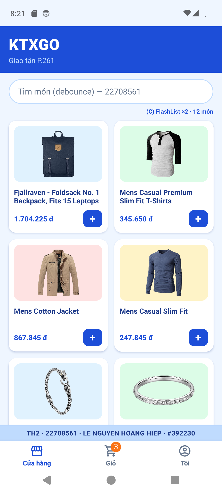
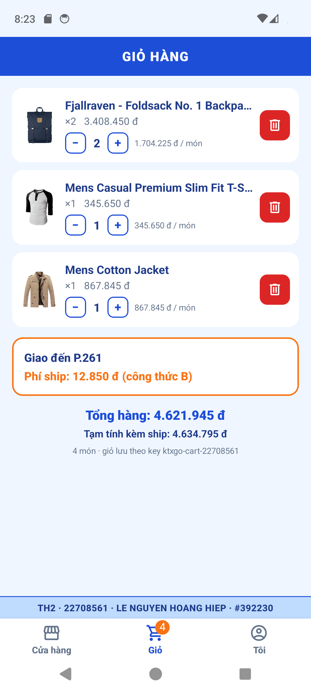

LE NGUYEN HOANG HIEP · MSSV 22708561 · https://github.com/dhdthoanghiep-commits/22708561_TH2.git · Stamp #392230 · Số cuối 1 → VARIANT: watermark Dưới | Login phone | Tab Shop→Giỏ→Tôi | Haptic selection | Phí ship B | Detail card

# KTXGo_22708561 — Đề kiểm tra Thực hành 2 (Lập trình cho thiết bị di động)

App React Native CLI + TypeScript **KTXGo** — giao đồ tận phòng ký túc xá: Auth Stack (Đăng nhập) → Main Tabs (Cửa hàng · Giỏ · Tôi); tab Cửa hàng có Stack Home (FlashList lưới 2 cột) → Chi tiết; giỏ Zustand + persist; danh sách món React Query + Axios; tab Tôi xin quyền Location + Haptic.

| Định danh | Giá trị |
|---|---|
| Họ tên (IN HOA) | LE NGUYEN HOANG HIEP |
| MSSV | 22708561 |
| Lớp | DHIOT19B |
| Repo | https://github.com/dhdthoanghiep-commits/22708561_TH2.git |
| `examStamp()` | 392230 |
| Dòng tên trên mọi màn | `TH2 · 22708561 · LE NGUYEN HOANG HIEP · #392230` |

## Số lấy từ `src/constants/student.ts` (không gõ tay trong code)

| Hằng số | Công thức | Giá trị với MSSV 22708561 (seed 561) | Dùng ở |
|---|---|---|---|
| `DEBOUNCE_MS` | 300 + (seed % 5) × 100 | 400 ms | `useDebouncedValue(keyword, DEBOUNCE_MS)` – HomeScreen |
| `STALE_TIME_MS` | 10 000 + (seed % 20) × 1000 | 11 000 ms | `useQuery({ staleTime: STALE_TIME_MS })` – Home/Detail |
| `PRICE_MULTIPLIER` | 15 000 + (seed % 40) × 500 | 15 500 | `Math.round(price * PRICE_MULTIPLIER).toLocaleString('vi-VN') + ' đ'` |
| `BASE_SHIP_FEE` | 8 000 + (seed % 10) × 1000 | 9 000 đ | `calcShipFee()` – useCampusLocation |
| `ROOM_LABEL` | `P.${100 + seed % 400}` | P.261 | Header Home, Giỏ, Detail |
| Key list | `` `${STUDENT.mssv}-${item.id}` `` | 22708561-1 … | FlashList / FlatList giỏ |
| Persist key giỏ | `` `ktxgo-cart-${STUDENT.mssv}` `` | ktxgo-cart-22708561 | cartStore (AsyncStorage) |
| Token giả | `` `ktxgo-${mssv}-${examStamp()}` `` | ktxgo-22708561-392230 | LoginScreen → authStore |

## Biến thể theo chữ số cuối = 1 (code luôn đọc `VARIANT`, không viết cứng)

| Watermark | Ô Login | Thứ tự Tab | Haptic | Phí | Detail |
|---|---|---|---|---|---|
| Dưới (`watermarkAtTop: false`) | phone | Shop→Giỏ→Tôi (`shopFirst`) | selection | B: `BASE_SHIP_FEE + Math.round(km * 1500) + 2000` | card |

## Công nghệ (theo giáo trình C1–C7)

- React Native CLI 0.87.1 + TypeScript (không dùng Expo), style 100% `StyleSheet.create`, không className / .css.
- Path alias: `@screens @components @constants @services @stores @hooks @navigation` (babel `module-resolver` + `tsconfig paths`), không có `../../../`.
- Chương 4: Flexbox, `@shopify/flash-list` `numColumns={2}`, debounce, pull-to-refresh, `SafeAreaProvider/SafeAreaView` (react-native-safe-area-context).
- Chương 5: React Navigation v7 — `RootNavigator` (Auth Flow 2 cây theo token), `AuthStack`, `MainTabs` (bottom-tabs + `tabBarBadge`), `ShopStack` (native-stack, Detail nhận `{ id: string }`).
- Chương 6: Zustand (`authStore`, `cartStore` + `persist` AsyncStorage), TanStack Query v5 (`useQuery` đủ pending / error / data, `refetch`), Axios instance `apiClient` + interceptor `X-Student-Id`.
- Chương 7: quyền Location (`PermissionsAndroid` → granted / denied / blocked, `Linking.openSettings()`, dò lại bằng `AppState`), `@react-native-community/geolocation`, Haversine, Haptic bằng `Vibration` API (bọc trong `services/haptics.ts`).
- Không làm: thanh toán thật, i18n, Lottie, Drawer, Vision Camera, Redux.

> FlashList: project dùng **FlashList v2** (bản `npm install` cài được cho RN 0.87, kiến trúc mới). Prop `estimatedItemSize` chỉ bắt buộc ở **v1** — v2 đã gỡ prop này và tự đo kích thước ô (đúng ghi chú Phần 4.3 mục 3 của giáo trình).

## Chạy app

```bash
npm install
npx react-native start            # Metro
npx react-native run-android      # Android Emulator (đã test: AVD Pixel_6)
# Máy ảo không có GPS thật → bơm toạ độ giả (≈1,2 km tới cổng KTX):
adb emu geo fix 106.6800 10.8310
```

Kiểm tra: `npx tsc --noEmit` (0 lỗi) · `npx eslint App.tsx src`.

## Cây thư mục

```
KTXGo_22708561/
├── README.md · App.tsx · package.json (name: ktxgo-22708561) · babel.config.js · tsconfig.json
├── docs/screenshot-th2-home.png · docs/screenshot-th2-cart.png
└── src/
    ├── constants/student.ts · constants/theme.ts
    ├── hooks/useDebouncedValue.ts · hooks/useCampusLocation.ts
    ├── services/apiClient.ts · services/productApi.ts · services/haptics.ts
    ├── stores/authStore.ts · stores/cartStore.ts
    ├── navigation/RootNavigator.tsx · AuthStack.tsx · MainTabs.tsx · ShopStack.tsx
    ├── components/ProductCard.tsx · components/Watermark.tsx · components/KtxButton.tsx
    └── screens/LoginScreen.tsx · HomeScreen.tsx · DetailScreen.tsx · CartScreen.tsx · MeScreen.tsx
```

## Đối chiếu yêu cầu đề

| Câu | Yêu cầu | Ở đâu |
|---|---|---|
| 1a | RN CLI + TS, thư mục `KTXGo_22708561`, name `ktxgo-22708561`, đủ cây + alias | `package.json`, `babel.config.js`, `tsconfig.json` |
| 1a | student.ts đủ seed + VARIANT + `examStamp()` (raw có `TH2\|`) | `src/constants/student.ts` |
| 1a | Root/Auth/MainTabs/ShopStack; Detail nhận `{ id: string }` | `src/navigation/*` |
| 1a | Login đúng ô phone (số cuối 1); có token → Main | `LoginScreen.tsx`, `RootNavigator.tsx` |
| 1b | Thứ tự tab theo `VARIANT.tabOrder`; `tabBarBadge` = tổng SL Zustand, ẩn khi 0 | `MainTabs.tsx` |
| 1b | Watermark mọi màn (vị trí theo VARIANT); Detail `presentation: VARIANT.detailPresentation`; SafeArea | `Watermark.tsx`, `ShopStack.tsx`, mọi screen |
| 2a | FlashList `numColumns={2}`, keyExtractor ghép MSSV, ProductCard tách file, debounce, không bọc ScrollView | `HomeScreen.tsx`, `ProductCard.tsx`, `useDebouncedValue.ts` |
| 2b | Axios instance + interceptor `X-Student-Id`; `useQuery` pending/error/data; lỗi có MSSV + Thử lại; pull-to-refresh = refetch; card → Detail đúng id | `apiClient.ts`, `productApi.ts`, `HomeScreen.tsx`, `DetailScreen.tsx` |
| 3a | cartStore `add / remove / changeQty / totalQuantity / totalAmount`, persist AsyncStorage key có MSSV; + (Home) và Thêm giỏ (Detail) cùng store + Haptic theo VARIANT; Giỏ đủ SL/xoá/tổng/ROOM_LABEL | `cartStore.ts`, `haptics.ts`, `CartScreen.tsx` |
| 3b | `useCampusLocation`: granted / denied / blocked, blocked → `Linking.openSettings()`; Haversine + phí B + `BASE_SHIP_FEE`; phí ở Tôi và phản ánh Giỏ; Đăng xuất về Login | `useCampusLocation.ts`, `MeScreen.tsx`, `CartScreen.tsx` |

## Ảnh máy ảo

| Home | Giỏ |
|---|---|
|  |  |
